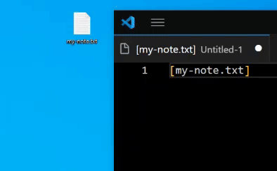

[繁體中文說明](README.zh-tw.md)

# File Linker

A VSCode extension that allows you to hover over and click on file names within square brackets to instantly open them using your system's specific search engine.

## Features

- **Instant File Opening**: Hover over any file name enclosed in square brackets (e.g., `[myfile.txt]`) and click the link to open it instantly.
- **Cross-Platform Support**: Works on both Windows and macOS.
- **Native Integration**:
  - On **Windows**, it leverages the powerful [Everything](https://www.voidtools.com/) search engine.
  - On **macOS**, it uses the built-in Spotlight search (`mdfind`).
- **System-Wide Search**: Finds files across your entire system, not just within the current workspace.
- **No Manual Pathing**: Eliminates the need to manually browse or type file paths.
- **Unicode and Emoji File Names**: Windows search results are read from Everything's UTF-8 export output, so file names such as `[👥meeting.txt]` can be opened reliably.

## Requirements

- **Windows**: The [Everything](https://www.voidtools.com/) application must be installed and running.
- **macOS**: No additional software is needed. The extension uses the built-in Spotlight functionality.

## Usage

1. **Mark Files**: In any text file (code, notes, README, etc.), mark a file name using square brackets: `[filename]`.
2. **Hover**: Move your cursor over the file name within the brackets.
3. **Click**: Click the "Open File" link that appears in the hover tooltip.

## Extension Settings

This extension does not add any VS Code settings.

## Known Issues

- On Windows, the extension requires Everything to be running. If it's not, a helpful error message will guide you to install it.
- On macOS, search results depend on your Spotlight index. If a file isn't found, ensure it's in a location indexed by Spotlight.

## Publishing and Token Safety

- Do not store real Marketplace or Open VSX tokens in this repository.
- Keep local token notes outside the repository, for example next to the project folder as `<repo path> note.txt`.
- Use `note.example.txt` as a template only; never paste real tokens into it.
- Use `npm run package:release` before publishing. It builds a VSIX and scans the package for blocked secret files and known token patterns.
- Use `npm run publish:all` only after the release package scan passes.

## Release Notes

### 1.1.7

- Fixed Windows file opening for names containing emoji, such as `[👥meeting.txt]`.
- Added UTF-8 Everything export handling to preserve non-ANSI file paths.
- Added release packaging safeguards to prevent local token notes or secret files from being included in VSIX packages.
- Hardened the integration test runner against inherited Electron environment variables.

### 1.1.4

- **Critical Bug Fix**: Resolved "spawn cmd.exe ENOENT" error when opening files with paths containing Chinese characters.
- **Improved User Experience**: Files are now opened in Explorer with automatic selection using the `/select` parameter.
- **Enhanced Reliability**: Removed problematic working directory parameter that caused file opening failures.

### 1.1.3

- Bug fixes and stability improvements.

### 1.1.1

- Added demo GIF to READMEs.
- Added link to Chinese README in English README.

### 1.1.0

- Added support for macOS using the native Spotlight search (`mdfind`).
- The extension is now cross-platform.

### 1.0.0

- Initial release of File Linker.
- Hover and click functionality for opening files on Windows.
- Bundled Everything CLI for seamless integration.

## Contributing

Contributions are welcome! Please feel free to submit a Pull Request on [GitHub](https://github.com/papple23g/file-linker).

## License

This project is licensed under the MIT License - see the [LICENSE.md](LICENSE.md) file for details.
